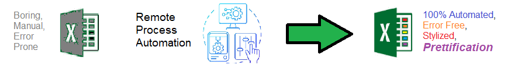

# Remote Process Automation for Excel  - Quickly format useful excel reports - Its EASY !!!   

## Description

Welcome to the ** Remote Process Automation for Excel ** repository! This solution generates formatted Excel reports  EASILY  !!!   

## NOTE - THIS REPOSITORY WORK IN PROGRESS 

Spread sheets are important data science - They are used by EVERYBODY - and everyone knows how to use them. 

The are many ways to do this. It isnt perfect !!! so Experiment. Branch it and Change it. SAVE YOURSELF HOURS !!! 

## Features

- Automates boring stuff 
- Easily Configurable 
- Makes your work open source 
- Invites Collaboration

## Notebook Features

- Self Documenting 
- Self Testing 
- Easily Configurable
- Includes Talking Code - The code explains itself
- Self Logging 
- Self Debugging 
- Low Code - or - No Code
- Educational 

## Getting Started

To get started with Remote Process Automation for Excel, follow these steps:

1. Clone the repository to your local machine.
2. Install the required dependencies listed at the top of the notebook.
3. Explore the example code provided in the repository and experiment.
4. Run the notebook and your find your most Critical Data - EASY !
5. You must provide a Logo.png file for your spreadsheets
6. You must configure your congiguration file to iidentify the your logo file location
6. You must designate which files or folders to format 
7. Test - Test - Test 

